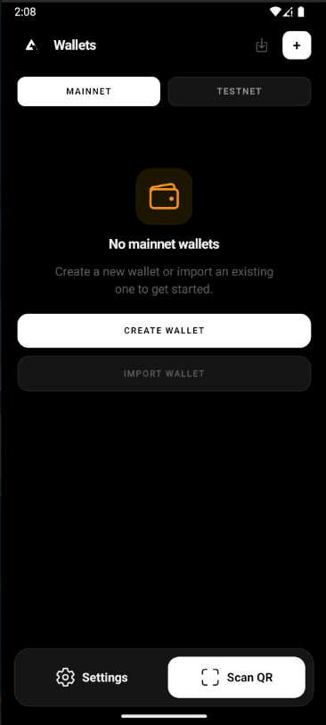
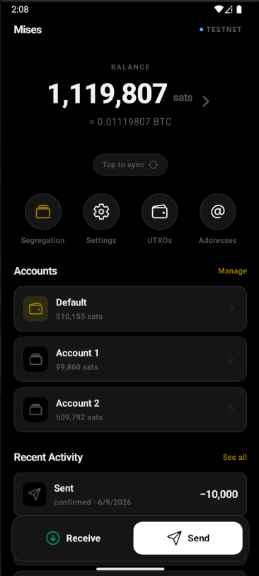
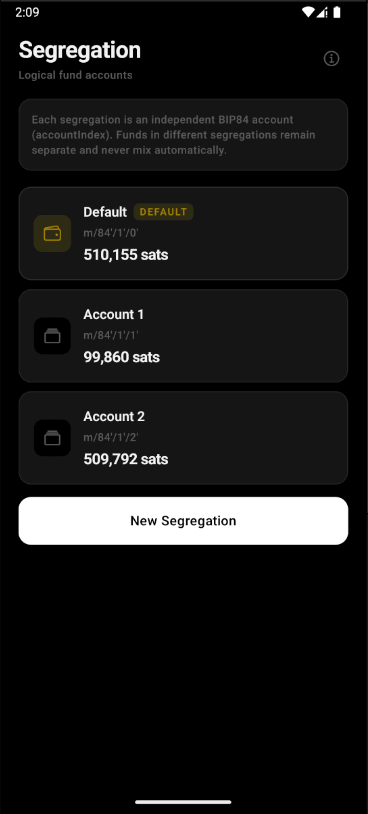
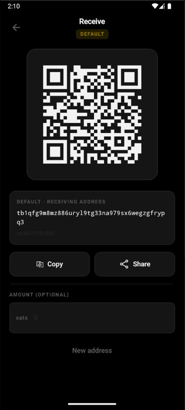
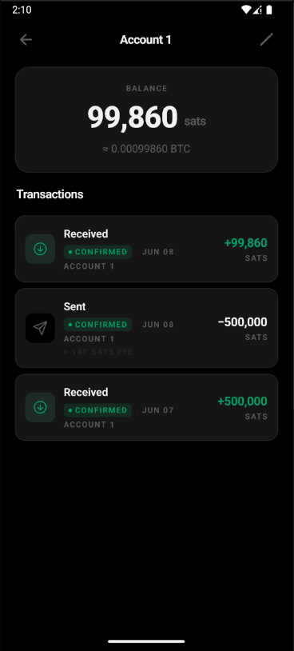
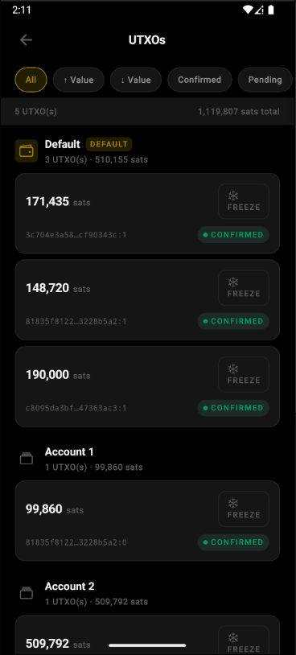
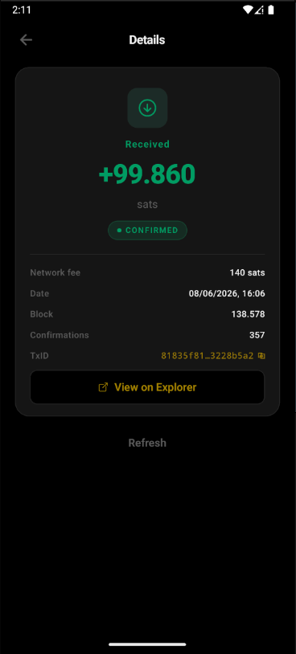

# UTX Wallet

<p align="center">
  
</p>

<p align="center">
  <strong>Self-custodial Bitcoin wallet · Personal node · Full UTXO control</strong>
</p>

<p align="center">
  
  
  
  
  
</p>
<p align="center">
  
  
</p>

---

UTX Wallet is a React Native mobile app for a Bitcoin wallet. It is built without Expo and uses TypeScript, Clean Architecture, reusable UI components, providers, hooks, services, repositories, use cases, and testable infrastructure.

The project is architecture-first, but it already contains a broad wallet prototype surface: onboarding screens, wallet creation/import flows, receive/send screens, transaction details, UTXO management, offline transaction storage, network/node settings, security settings, native Android/iOS projects, and extensive unit/integration tests.

Some Bitcoin-facing behavior is implemented through `bitcoin-tx-lib`, `@mempool/mempool.js`, SQLite, and encrypted storage adapters. Treat this code as application architecture and prototype logic unless a later task explicitly hardens it for production wallet use. Security-sensitive and funds-moving behavior still needs explicit review before production use.

## Stack

- React Native CLI, no Expo
- React 19 and React Native 0.85
- TypeScript strict mode
- React Navigation native stack
- Jest
- React Native Testing Library
- ESLint and Prettier
- Android/iOS native projects
- `@op-engineering/op-sqlite` for local database storage
- `react-native-encrypted-storage` for encrypted key/value storage
- `bitcoin-tx-lib` for mnemonic, HD wallet, address, transaction, and signing primitives
- `@mempool/mempool.js` plus custom HTTP adapters for mempool-compatible APIs
- `react-native-qrcode-svg`, `react-native-svg`, safe-area, screens, and clipboard support

## Architecture

The project follows Clean Architecture boundaries:

```text
src/
  app/              App composition, dependency providers, navigation
  core/             Domain, use cases, application services, infrastructure
  presentation/     Components, hooks, screen shells
  shared/           Constants, theme, assets, types, utilities

tests/
  mocks/            Storage, navigation, API, provider, and render helpers
  setup/            Jest setup
  unit/             Unit tests by layer
  integration/      End-to-end use case integration scenarios
```

Main dependency flow:

```text
screens/components -> hooks -> providers/services -> use cases -> repository interfaces -> infrastructure implementations
```

Screens stay thin and consume hooks. Hooks and providers expose services. Services orchestrate use cases. Use cases depend on domain repository interfaces. Infrastructure contains concrete implementations for storage, APIs, adapters, and repositories.

## Project Structure

```text
.
  App.tsx                         Top-level React Native entry component
  index.js                        Native app registration
  app.json                        React Native app metadata
  package.json                    Scripts, dependencies, engines
  tsconfig.json                   TypeScript strict configuration
  jest.config.js                  Jest configuration
  babel.config.js                 Babel configuration
  metro.config.js                 Metro configuration
  Gemfile                         iOS CocoaPods/Ruby tooling
  AGENTS.md                       Engineering rules for future agents
  assets/                         App icon, splash, and logo assets
  android/                        Android native project and Gradle scripts
  ios/                            iOS native project and Podfile
  src/                            Application source code
  tests/                          Test doubles, setup, unit, and integration tests
  __tests__/                      React Native template-level App test
```

## Source Layout

```text
src/app/
  App.tsx                         Safe area, providers, status bar, root navigator
  navigation/
    AuthNavigator.tsx             Welcome, create/import wallet, backup, seed confirmation
    AppNavigator.tsx              Main authenticated wallet/settings stack
    RootNavigator.tsx             Chooses auth vs app stack
    routes.ts                     Typed route names and stack params
  providers/
    AppProvider.tsx               Dependency graph and service composition
    ThemeProvider.tsx             Light/dark theme context
    SecurityProvider.tsx          Security settings and reauthentication context
    NetworkProvider.tsx           Network/node config context
    WalletProvider.tsx            Wallet list/selection/sync context
    AddressProvider.tsx           Receive address context
    SendProvider.tsx              Send transaction context
    TransactionHistoryProvider.tsx Transaction detail/history context
    OfflineModeProvider.tsx       Offline transaction context
    CreateWalletProvider.tsx      Onboarding wallet creation flow state

src/core/
  domain/                         Framework-free domain model and use cases
  application/                    App-level services, DTOs, errors
  infrastructure/                 API, storage, adapter, repository implementations

src/presentation/
  components/                     Base, form, security, and wallet UI components
  hooks/                          UI-facing hooks over providers/services
  screens/                        Auth, home, wallet, settings, offline, safe mode screens

src/shared/
  constants/                      Networks, colors, spacing, typography
  theme/                          Base, light, and dark theme definitions
  types/                          Shared TypeScript helpers
  utils/                          Pure utilities
  assets.ts                       Centralized asset exports
```

## Navigation

Auth routes:

- `Welcome`
- `CreateWallet`
- `ImportWallet`
- `BackupSeed`
- `ConfirmSeed`

App routes:

- `Home`
- `WalletDetails`
- `Receive`
- `Send`
- `TransactionDetails`
- `TransactionSuccess`
- `Utxos`
- `Settings`
- `SecuritySettings`
- `NetworkSettings`
- `NodeSettings`
- `BackupSettings`
- `OfflineMode`
- `SafeMode`

Route params are centralized in `src/app/navigation/routes.ts`. `TransactionDetails` accepts an optional `txid`; `TransactionSuccess` receives `txid`, `amountSats`, and `feeSats`.

## Domain Layer

Domain entities:

- `Wallet`, `Account`
- `Address`
- `Utxo`
- `Transaction`, `TransactionDetail`, `TransactionPreview`
- `BuiltTransaction`, `SignedTransaction`
- `OfflineTransaction`
- `Network`, `NetworkConfig`, node connection status/result types
- `SecuritySettings`

Value objects:

- `BitcoinAddress`
- `DerivationPath`
- `NetworkType`
- `SatoshiAmount`
- `TransactionId`

Repository and provider contracts:

- `WalletRepository`
- `AddressRepository`
- `TransactionRepository`
- `UtxoRepository`
- `OfflineTransactionRepository`
- `SecuritySettingsRepository`
- `SyncStateRepository`
- `NodeRepository`
- `BlockchainProvider`
- `BlockchainExplorer`
- `WalletAddressProvider`
- `TransactionSigner`
- `BiometricAuthProvider`
- `PinHasher`

Domain services:

- `CoinSelectionService`
- `FeeEstimationService`

Domain utilities:

- `seedChallenge` helpers for selecting and validating seed backup challenge words

## Use Cases

Wallet use cases:

- Create, import, load, select, and delete wallets
- Generate mnemonic
- Generate current/next receive address
- Mark address as used
- Load transactions and UTXOs
- Sync wallet, balance, transactions, and UTXOs
- Freeze and unfreeze UTXOs

Transaction use cases:

- Validate address
- Fetch fee rates
- Preview transaction
- Build transaction
- Sign transaction
- Broadcast transaction
- Get transaction detail

Network use cases:

- Change active network/node configuration
- Test personal node connection

Offline use cases:

- Save offline transaction
- Load offline transactions
- Delete offline transaction

Security use cases:

- Load and save security settings
- Set, verify, and clear PIN
- Check biometric availability
- Authenticate with biometric provider
- Reauthenticate with PIN or biometric method

## Application Services

Application services orchestrate domain use cases for providers and hooks:

- `WalletService`
- `AddressService`
- `NetworkService`
- `SendService`
- `TransactionHistoryService`
- `OfflineModeService`
- `SecurityService`
- `TransactionService`

The provider graph is assembled in `src/app/providers/AppProvider.tsx`. Dependencies are constructed once with `useRef`, then injected through typed React contexts.

## Infrastructure

API clients:

- `FetchHttpClient` implements the `HttpClient` interface with timeout/error handling.
- `MempoolApiClient` wraps mempool-compatible address, UTXO, transaction, fee, block height, healthcheck, and broadcast endpoints.

Adapters:

- `MempoolApiAdapter` implements public API node behavior and blockchain provider methods.
- `PersonalNodeAdapter` implements personal node configuration, network compatibility checks, auth token headers, and mempool-compatible blockchain methods.
- `NodeProviderSelector` chooses public API vs personal node behavior based on network configuration.
- `MempoolExplorerAdapter` fetches transaction detail data from mempool-compatible explorer endpoints.
- `WalletKeyAddressProvider` derives receive/change addresses from stored wallet secrets.
- `WalletTransactionSigner` signs built transactions by scanning receive/change keys up to a fixed gap limit.
- `WebCryptoPinHasher` hashes and verifies PIN values.
- `NoopBiometricAuthAdapter` is a placeholder biometric provider.
- `NoopScreenCaptureAdapter` is a placeholder screen capture guard.

Repositories:

- `WalletRepositoryImpl`
- `AddressRepositoryImpl`
- `TransactionRepositoryImpl`
- `UtxoRepositoryImpl`
- `OfflineTransactionRepositoryImpl`
- `SecuritySettingsRepositoryImpl`

Storage:

- `OpSQLiteDatabase` wraps `@op-engineering/op-sqlite`.
- `WalletStorage`, `WalletKeyStorage`, `AddressStorage`, `UtxoStorage`, `TransactionStorage`, `OfflineTransactionStorage`, `SyncStateStorage`, `NetworkConfigStorage`, and `SecuritySettingsStorage` persist app state.
- `EncryptedStorageAdapter` implements secure key/value storage through `react-native-encrypted-storage`.
- `InMemorySecureStorage` is available for tests and lightweight in-memory scenarios.

## Presentation Layer

Base components:

- `AppButton`
- `AppCard`
- `AppConfirmModal`
- `AppEmptyState`
- `AppHeader`
- `AppIconButton`
- `AppInput`
- `AppLoading`
- `AppLogo`
- `AppScreen`
- `AppSkeleton`
- `AppText`

Form and security components:

- `FormInput`
- `FormSection`
- `PinInputModal`

Wallet components:

- `AddressCard`
- `BalanceCard`
- `FeeSelector`
- `NetworkBadge`
- `QrCodeView`
- `SeedGrid`
- `TransactionItem`
- `UtxoItem`

Hooks:

- `useAppNavigation`
- `useCreateWallet`
- `useHomeWallet`
- `useImportWallet`
- `useNetwork`
- `useNetworkSettings`
- `useOfflineMode`
- `useReauthenticate`
- `useReceiveBitcoin`
- `useSafeMode`
- `useSecuritySettings`
- `useSendBitcoin`
- `useTheme`
- `useTransactionDetails`
- `useUtxos`
- `useWallet`
- `useWalletSync`

Screens:

- Auth: welcome, create wallet, import wallet, backup seed, confirm seed
- Home: wallet overview and primary actions
- Wallet: details, receive, send, transaction review modal, transaction success, transaction details, UTXOs
- Settings: settings menu, network settings, node settings, backup settings, security settings
- Modes: offline mode and safe mode
- Loading screen

## Bitcoin Scope Prepared

The architecture is prepared for:

- `mainnet`
- `testnet`
- `testnet3`
- `testnet4`
- online mode
- offline mode
- secure mode with personal node

`DEFAULT_NETWORK` is `testnet4`. `SUPPORTED_NETWORKS` includes `mainnet`, `testnet`, `testnet3`, and `testnet4`. The selectable network settings currently expose `mainnet`, `testnet3`, and `testnet4`.

## Implemented Wallet Capabilities

Implemented or scaffolded capabilities include:

- Wallet creation and import through repository/use case boundaries
- Mnemonic generation through `bitcoin-tx-lib`
- Wallet secret storage through encrypted storage adapter
- Receive/change address derivation through stored wallet keys
- Receive address display with QR code component
- Local wallet, address, UTXO, transaction, offline transaction, security, sync, and network config persistence
- Public mempool-compatible API access for balance, UTXOs, transactions, fee rates, transaction status, block height, healthcheck, and broadcast
- Personal node configuration and connection testing against `/v1/network`
- Node mode selection between public API and personal-node-compatible endpoints
- Wallet sync orchestration for addresses, UTXOs, transactions, balance, and sync state
- Fee estimation and coin selection services
- Transaction preview, build, sign, and broadcast use case pipeline
- Transaction detail lookup
- Offline transaction preparation, import/list/delete, and later broadcast path
- UTXO freeze/unfreeze
- PIN setup, verification, clearing, security settings, reauthentication flow, and biometric placeholder
- Light/dark theme provider and black/white minimal UI language

## Important Limitations

- This is not production-ready wallet software.
- Funds-moving code must be security-reviewed before real use.
- Biometric authentication is currently backed by a no-op adapter.
- Screen capture protection is currently backed by a no-op adapter.
- Personal node support expects mempool-compatible endpoints and `/v1/network` for connection tests.
- The signer scans receive and change addresses up to a fixed gap limit of 50.
- Only behavior represented in use cases and tests should be considered intentionally supported.
- Keep future Bitcoin rules behind domain contracts, use cases, services, providers, and hooks before exposing them to screens.

## Running

Install dependencies:

```sh
npm install
```

Start Metro:

```sh
npm start
```

Run on Android:

```sh
npm run android
```

Run on the currently active Android device/emulator using only its ABI:

```sh
npm run android:active
```

Run on iOS:

```sh
bundle install
bundle exec pod install --project-directory=ios
npm run ios
```

## Build

Build Android debug APK:

```sh
npm run build:android:debug
```

Build a smaller debug APK for x86_64 emulators:

```sh
npm run build:android:debug:x86_64
```

Build Android release APK:

```sh
npm run build
```

Generated APKs:

```text
android/app/build/outputs/apk/debug/app-debug.apk
android/app/build/outputs/apk/release/app-release.apk
```

Clean Android build outputs:

```sh
npm run clean:android
```

## Quality Checks

Run the full validation before finishing implementation changes:

```sh
npm run validate
```

Individual commands:

```sh
npm run typecheck
npm run lint
npm test
npm run test:ci
npm run test:watch
npm run format
```

Run `npm run lint` for every implementation change before considering the work complete. Fix all reported errors and warnings instead of leaving lint debt for a later change.

When changing navigation, native dependencies, entrypoints, or build scripts, also run:

```sh
npm run build:android:debug
```

## Tests

The test suite is organized by layer and feature:

- `__tests__/App.test.tsx` checks the top-level React Native app render.
- `tests/setup/jest.setup.tsx` configures the Jest environment.
- `tests/mocks/` contains API, database, navigation, storage, and render helpers.
- `tests/unit/value-objects/` covers domain value object validation.
- `tests/unit/usecases/` covers wallet, transaction, network, offline, and security use cases.
- `tests/unit/services/` covers domain/application services.
- `tests/unit/adapters/` covers API/node/signing/explorer adapters.
- `tests/unit/repositories/` covers repository implementations.
- `tests/unit/storage/` covers storage implementations.
- `tests/unit/hooks/` covers UI-facing hooks.
- `tests/unit/components/` covers reusable UI components.
- `tests/unit/screens/` covers screen behavior.
- `tests/integration/` covers create wallet, import wallet, sync wallet, receive address, build transaction, sign/broadcast, safe mode, offline mode, freeze UTXO, and security settings scenarios.

## Development Rules

- Keep TypeScript strict.
- Keep business logic out of screens.
- Use SOLID, Clean Code, and small testable units.
- Add or update tests for behavior changes.
- Run lint on every implementation and keep the lint output clean.
- Keep external integrations inside `src/core/infrastructure`.
- Keep repository interfaces in `src/core/domain/repositories`.
- Add wallet behavior through use cases before exposing it to UI.
- Prefer base components from `src/presentation/components/base`.
- Keep app-wide dependencies in providers and services instead of constructing them in screens.
- Preserve network support for `mainnet`, `testnet`, `testnet3`, and `testnet4`.

See [AGENTS.md](./AGENTS.md) for detailed engineering guidance for future implementation work.

## Android Emulator Troubleshooting

If `npm run android` fails during `:app:installDebug` with `Unknown API Level`, `ShellCommandUnresponsiveException`, or `INSTALL_FAILED_INSUFFICIENT_STORAGE`, the build is usually fine and the AVD/ADB install step is failing.

Recommended checks:

```sh
adb devices -l
adb shell getprop sys.boot_completed
adb shell df -h /data
```

If the emulator has little free space, wipe the AVD data from Android Studio Device Manager or create an emulator with more internal storage. For x86_64 emulators, prefer:

```sh
npm run android:active
```
